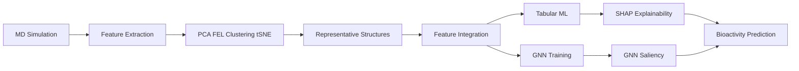

# 🧠 AI-Assisted Prediction of Bioactivity and Protein–Ligand Interactions

This repository contains the datasets, scripts, and trained models developed for the study:  
**“AI-Assisted Prediction of Bioactivity and Protein–Ligand Interactions”**  
which integrates **classical Molecular Dynamics (MD)** simulations with **Graph Neural Network (GNN)**-based machine learning to predict protein–ligand bioactivity with mechanistic interpretability.

---

## 📑 Table of Contents

1. [Overview](#overview)  
2. [Workflow Summary](#workflow-summary)  
3. [Repository Structure](#repository-structure)  
4. [Installation](#installation)  
5. [Data Preparation](#data-preparation)  
6. [Running the Analysis](#running-the-analysis)  
7. [AI/ML Modeling](#aiml-modeling)  
8. [Results and Outputs](#results-and-outputs)  
9. [Citing This Work](#citing-this-work)  
10. [License](#license)
11. [Contact](#contact)

---

## 🧩 Overview

This project demonstrates a **hybrid MD + AI workflow** that unifies:

- **Molecular Dynamics simulations**  
- **Physics-informed descriptors**  
- **Machine Learning models (RF/XGBoost/MLP)**  
- **Graph Neural Networks (GCN/GAT/GIN)**  
- **Dimensionality reduction (PCA, t-SNE)**  
- **Free energy landscape (FEL) analysis**  
- **Explainable AI (SHAP + GNN saliency)**  

The study uses **noscapine-based ionic liquids (NOS–ILs)** bound to **human serum albumin (HSA)** as a model system to demonstrate how MD-derived structural features improve AI-driven prediction of:

- Binding affinity  
- Cytotoxicity (logIC₅₀)  
- Mechanistic interaction fingerprints  

**Key Objectives:**

- Extract both **global** and **local** MD descriptors (RMSD, Rg, SASA, Trp-214 exposure, π–cation interactions, hydrogen bonds).  
- Identify **conformational states** via PCA, FEL, and clustering.  
- Train **GNN models** on molecular graphs enhanced with MD features.  
- Build **tabular ML models** using merged descriptors + SHAP explainability.  
- Provide a **fully reproducible pipeline** for MD-to-AI bioactivity prediction.

---

## ⚙️ Workflow Summary



## 📁 Repository Structure

ai-protein-ligand-bioactivity/
│
├── data/
│   ├── descriptor_data.csv
│   ├── md_features.csv
│   ├── global_md_with_sasa.csv
│   ├── final_features.csv
│   └── graphs/               # Graph data for GNN (PyTorch Geometric)
│
├── scripts/
│   ├── ai_explainable_pipeline_v_5.py     # Tabular ML + SHAP + t-SNE
│   ├── prepare_graphs.py                  # Converts molecules → graph objects
│   ├── gnn_train.py                       # GNN training & evaluation
│   ├── feature_merging_utils.py
│   └── plotting_utils.py
│
├── models/
│   ├── saved_tabular/
│   └── saved_gnn/
│
├── figs/                                  # SHAP, t-SNE, PCA, GNN saliency
│
├── requirements.txt
└── README.md
```

🛠️ Installation

### Create environment

```bash
conda create -n ai_env python=3.10
conda activate ai_env

```

### Install dependencies

```bash
pip install -r requirements.txt

```

Note: GNN models require PyTorch and Torch Geometric.
Install PyTorch first, then run:

```bash
pip install torch-geometric

```

(See torch-geometric.org for CUDA-specific wheels.)

📦 Data Preparation
1️⃣ Merge descriptor + MD features

Produces the primary dataset for tabular ML:
final_features.csv

2️⃣ Generate graph datasets (for GNN training)

```bash
python scripts/prepare_graphs.py \
    --smiles data/descriptor_data.csv \
    --md data/md_features.csv \
    --out data/graphs/
```

Each molecule becomes a PyTorch Geometric graph object with:

o node features
o edge features
o optional MD descriptors appended as graph-level attributes

▶️ Running the Analysis
Tabular ML Pipeline + Explainability

```bash
python scripts/ai_explainable_pipeline_v_5.py \
    --input data/final_features.csv \
    --model XGB \
    --target logIC50 \
    --explain \
    --save-plots
```

Outputs:

o predictions.csv
o SHAP summary + feature importance
o t-SNE visualizations
o PCA embeddings
o performance metrics

**Graph Neural Network (GNN) Models**

Example: Train GIN with MD features integrated:

```bash
python scripts/gnn_train.py \
    --graphs data/graphs/ \
    --model GIN \
    --epochs 200 \
    --batch-size 32 \
    --lr 1e-3 \
    --target logIC50 \
    --use-md-features
```

Outputs:

o Trained GNN model (.pt)
o GNN predictions (csv)
o Node/edge saliency maps
o Attention weights (for GAT)

🤖 AI/ML Modeling

Classical ML Models

o Random Forest (RF)
o XGBoost (XGB)
o Multilayer Perceptron (MLP)

Graph Neural Networks

o GCN
o GIN
o GAT (attention-based)

Explainability

o SHAP → tabular ML interpretation
o GNN saliency / attention → structural importance

Dimensionality Reduction

o PCA
o t-SNE
o FEL mapping

📊 Results and Outputs

Generated in the figs/ folder:

o SHAP barplots & beeswarm
o t-SNE cluster maps
o PCA plots
o FEL surfaces
o GNN saliency heatmaps
o predictions.csv

📖 Citing This Work

If you use this repository, please cite:

Panchal S.,
AI-Assisted Prediction of Bioactivity and Protein–Ligand Interactions,
GitHub Repository, 2025.

📄 License

This project is released under the MIT License.

📬 Contact

For questions, collaborations, or issues:

📧 Sagar Panchal
GitHub: https://github.com/ssagar61 
